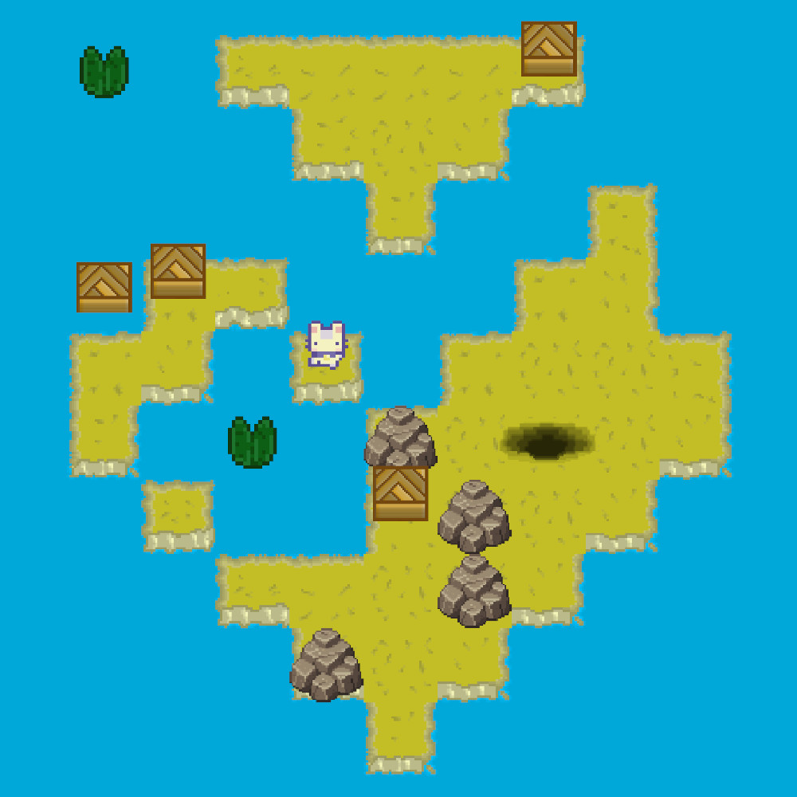

# Buncy

Un jeu de type Sokoban où vous incarnez un lapin des îles qui doit retrouver son terrier.

Ce jeu a été créé lors d'une formation avec pour contraintes :

- Utiliser C# et [Raylib](https://www.raylib.com/)
- Pas de bibliothèque externe
- Jeu en 2D
- Utiliser un tableau à 2 dimensions et exploiter des algorithmes associés
- POO : encapsulation, héritage et polymorphisme
- Système de scènes
- Service Locator
- Réaliser un [manuel d'utilisation](docs/notice.md) et un [document technique](docs/tech.md)